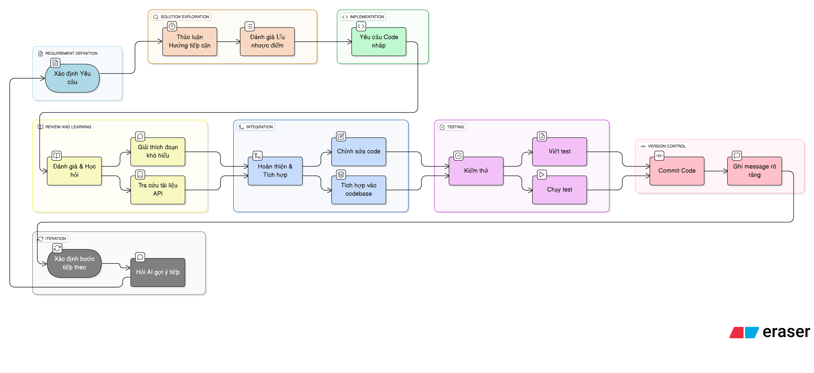

# Quy trình Pair-programming hiệu quả với AI

## Nguyên tắc cốt lõi: Lập trình viên là người dẫn dắt

Khi làm việc với AI, hãy luôn nhớ rằng **lập trình viên là kiến trúc sư, còn AI là người thợ xây aka.nô lệ**. AI có thể đặt những viên gạch (viết code) rất nhanh, nhưng lập trình viên là người quyết định cấu trúc của toàn bộ công trình.

Mục tiêu không phải là để AI tự động làm mọi thứ, mà là để lập trình viên đưa ra quyết định tốt hơn, nhanh hơn.

---

## Quy trình làm việc lặp (Iterative Workflow)

Để kiểm soát AI và đảm bảo chất lượng, hãy áp dụng một quy trình làm việc có cấu trúc và lặp lại. Thay vì đưa ra một yêu cầu lớn, hãy chia nhỏ công việc và dẫn dắt AI từng bước một.

**Diễn giải các bước:**

1.  **Xác định Yêu cầu:** Trình bày một yêu cầu duy nhất, cụ thể và nhỏ nhất có thể.
2.  **Thảo luận Hướng tiếp cận:** Đừng yêu cầu AI viết code ngay. Hãy hỏi về các hướng tiếp cận, ưu nhược điểm của từng giải pháp.
3.  **Yêu cầu Code nháp:** Chọn một hướng đi và yêu cầu AI phác thảo code cho giải pháp đó.
4.  **Đánh giá & Học hỏi:** Xem lại code AI viết. Yêu cầu nó giải thích những đoạn khó hiểu, hoặc tra cứu tài liệu về API liên quan. Đây là bước quan trọng để lập trình viên thực sự hiểu và kiểm soát được code.
5.  **Hoàn thiện & Tích hợp:** Dựa trên code nháp của AI, hãy tự mình hoàn thiện, chỉnh sửa và tích hợp vào codebase. **Đừng bao giờ** sao chép-dán một cách mù quáng.
6.  **Kiểm thử:** Luôn viết và chạy test cho code mới để đảm bảo tính đúng đắn.
7.  **Commit Code:** Khi đã hài lòng, hãy commit thay đổi với một message rõ ràng.
8.  **Xác định bước tiếp theo:** Hỏi AI gợi ý về những gì có thể thực hiện tiếp theo và lặp lại quy trình.

---

## Các Kỹ thuật Hỗ trợ

Để quy trình trên hoạt động trơn tru, lập trình viên cần nắm vững hai kỹ thuật sau:

### 1. Cấu trúc Prompt hiệu quả (Framework R-C-G)

Một prompt tốt thường bao gồm 3 phần: **Role (Vai trò)**, **Context (Bối cảnh)**, và **Goal (Mục tiêu)**.

*   **Role:** "Bạn là một lập trình viên senior chuyên về React..."
*   **Context:** "...Tôi đang làm việc trên file @/components/LoginForm.tsx. File này chứa form đăng nhập..."
*   **Goal:** "...Hãy giúp tôi thêm chức năng xác thực mật khẩu phía client, yêu cầu mật khẩu phải có ít nhất 8 ký tự, 1 chữ hoa và 1 số."

### 2. Cung cấp Ngữ cảnh Chính xác

Cursor học từ ngữ cảnh lập trình viên cung cấp. Ngữ cảnh càng chính xác, kết quả càng tốt.

*   **Cung cấp file liên quan:** Khi sửa một component React, hãy `@` cả file component, file style CSS/SCSS và file test của nó.
*   **Cung cấp ví dụ:** Để AI sinh code theo một phong cách nhất định, hãy cho nó một ví dụ. "Hãy viết hàm này theo phong cách giống như hàm `calculatePrice` trong file @/utils/pricing.ts".

---