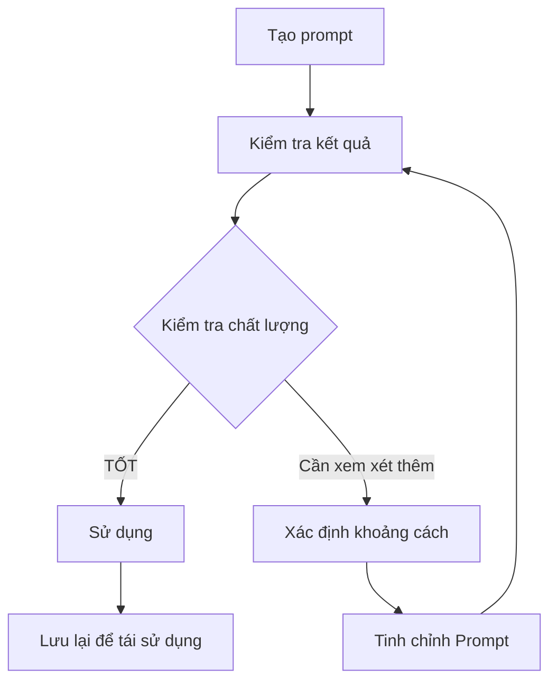

# 🏗️ Module 1: Nguyên Tắc Cốt Lõi

Để xây dựng một prompt hiệu quả, Business Analyst cần nắm vững **5 Nguyên tắc vàng** của prompt engineering. Những nguyên tắc này đảm bảo rằng AI có thể hiểu rõ yêu cầu và tạo ra kết quả chất lượng cao, sẵn sàng sử dụng trong môi trường production.

:::info 🎯 Mục Tiêu
Sau module này, BA sẽ có khả năng:
- ✅ Áp dụng **5 Nguyên tắc vàng** vào mọi prompt
- ✅ Nhận biết và tránh **các lỗi phổ biến**
- ✅ Đánh giá chất lượng prompt theo **tiêu chuẩn ngành**
- ✅ Tối ưu hóa prompt để đạt **90%+ độ chính xác**
:::

---

## 🥇 Nguyên tắc #1: Rõ ràng và Cụ thể (Clarity & Specificity)

**Nguyên tắc quan trọng nhất:** AI không thể đọc được suy nghĩ của con người. Một prompt mơ hồ sẽ dẫn đến kết quả chung chung và không sử dụng được.

### ❌ **Ví Dụ Sai:**
```
"Tạo tài liệu về flow đăng ký."
"Viết user story cho tính năng thanh toán."
"Mô tả quy trình onboarding."
```

### ✅ **Ví Dụ Đúng:**
```
"Tạo tài liệu đặc tả chi tiết cho luồng đăng ký người dùng B2C bằng email/password, 
bao gồm: email verification, password strength validation, error handling cho 
duplicate email, và success confirmation với redirect đến dashboard."

"Viết 5 user stories cho payment flow của e-commerce website, covering: 
credit card payment, PayPal integration, payment failure scenarios, 
refund process, và payment history tracking."
```

### 🎯 **Danh Sách Kiểm Tra Tính Cụ Thể:**
- [ ] **Who:** Đối tượng người dùng cụ thể (B2B admin, B2C customer, etc.)
- [ ] **What:** Chức năng/tính năng chi tiết  
- [ ] **Where:** Nền tảng/bối cảnh (web app, mobile, API, etc.)
- [ ] **When:** Thời gian/sự kiện (on page load, after payment, etc.)
- [ ] **How:** Chức năng/cách tiếp cận (step-by-step, table format, etc.)

---

## 🎭 Nguyên tắc #2: Cung cấp Đầy đủ Ngữ cảnh

AI cần hiểu **business context** để tạo ra nội dung phù hợp với domain và yêu cầu của ngành.

### 🏢 **Mẫu Bối Cảnh Dự Án:**
```
**Project:** [Tên dự án + mô tả ngắn]
**Industry:** [Fintech/E-commerce/Healthcare/etc.]  
**Target Users:** [B2B/B2C + demographics]
**Tech Stack:** [Web/Mobile/API + key technologies]
**Business Goals:** [KPIs và success metrics]
**Constraints:** [Security/Compliance/Performance requirements]
```

### 🎯 **Ví Dụ Định Nghĩa Persona:**
```
"Đóng vai một Senior Business Analyst với 8 năm kinh nghiệm trong fintech, 
chuyên về payment systems và regulatory compliance (PCI DSS, PSD2)."

"Hãy là một Product Owner của startup e-commerce B2C, focus vào user experience 
và conversion optimization cho millennial demographics."
```

### 📚 **Tích Hợp Tài Liệu Tham Khảo:**
- **Câu chuyện của người dùng:** Sao chép-dán từ dự án Jira/Docs
- **Quy tắc nghiệp vụ** Chính sách hiện hành và giới hạn
- **Wireframes:** Link Figma hoặc mô tả ảnh chụp màn hình

---

## ⚡ Nguyên tắc #3: Xác định Rõ ràng Nhiệm vụ 

Sử dụng **action verbs** mạnh mẽ và cấu trúc command rõ ràng.

### 🎯 **Bộ Công Cụ Động Từ Mạnh Mẽ:**

| Danh Mục | Động Từ | Trường Hợp Sử Dụng |
|----------|-------|-----------|
| **Tạo** | Tạo, Xây dựng, Thiết kế | Tài liệu mới, templates, frameworks |
| **Phân Tích** | Phân tích, Đánh giá, So sánh | Phân tích yêu cầu, phân tích khoảng trống |
| **Chuyển Đổi** | Chuyển đổi, Viết lại, Cải thiện | Chuyển đổi định dạng, tối ưu nội dung |
| **Sinh Ra** | Sinh ra, Liệt kê, Enumerate | Test cases, kịch bản, checklists |
| **Hình Tượng Hóa** | Vẽ, Minh họa, Mô tả | Sơ đồ, lưu đồ, wireframes |

### ✅ **Mẫu Cấu Trúc Nhiệm Vụ:**
```
**Hành động chính:** [Động từ mạnh + tân ngữ cụ thể]
**Nhiệm vụ phụ:** [Danh sách được đánh số gồm 3-5 bước cụ thể]
**Tiêu chí thành công:** [Cách đo lường mức độ hoàn thành]
**Ràng buộc:** [Những điều cần tránh hoặc hạn chế]
```

---

## 📋 Nguyên tắc #4: Chỉ định Định dạng Đầu ra

Yêu cầu AI trả về kết quả theo **format chuẩn** để dễ dàng integrate vào workflow.

### 🛠️ **Tùy Chọn Định Dạng:**

| Định Dạng | Tốt Nhất Cho | Ví Dụ Sử Dụng |
|--------|----------|---------------|
| **Markdown** | Tài liệu, đặc tả | Yêu cầu kỹ thuật, hướng dẫn người dùng |
| **JSON** | Cấu trúc dữ liệu, APIs | File cấu hình, dữ liệu test |
| **Mermaid** | Sơ đồ trực quan | Lưu đồ, sơ đồ tuần tự |
| **Bảng** | Dữ liệu có cấu trúc | Ma trận tính năng, test cases |
| **Templates** | Tài liệu chuẩn hóa | User stories, tiêu chí chấp nhận |

### 📝 **Ví Dụ Đặc Tả Định Dạng:**
```
"Trả về kết quả dưới dạng Markdown table với columns: 
Feature Name, Priority (High/Medium/Low), Effort (1-5), Dependencies, Notes."

"Sử dụng JSON format với structure: 
{
  'user_stories': [{'id', 'title', 'description', 'acceptance_criteria'}],
  'test_scenarios': [{'scenario', 'steps', 'expected_result'}]
}"
```

---

## 🔄 Nguyên tắc #5: Lặp lại và Tinh chỉnh

Prompt engineering là một **quá trình lặp đi lặp lại**. Hiếm khi có được kết quả hoàn hảo ngay lần đầu.

### 🎯 **Khung Lặp Lại:**



### 📊 **Tiêu Chí Đánh Giá Chất Lượng:**

| Khía Cạnh | Câu Hỏi | Điểm (1-5) |
|--------|-----------|-------------|
| **Độ Chính Xác** | Thông tin có chính xác và cập nhật? | ⭐⭐⭐⭐⭐ |
| **Tính Đầy Đủ** | Có bao phủ đầy đủ requirements? | ⭐⭐⭐⭐⭐ |
| **Tính Rõ Ràng** | Dễ hiểu và actionable? | ⭐⭐⭐⭐⭐ |
| **Tính Nhất Quán** | Tuân thủ standards và conventions? | ⭐⭐⭐⭐⭐ |
| **Tính Khả Dụng** | Ready-to-use không cần edit nhiều? | ⭐⭐⭐⭐⭐ |

### 🛠️ **Kỹ Thuật Tinh Chỉnh:**
1. **Thêm Ràng Buộc:** Chỉ định những gì cần tránh hoặc loại trừ
2. **Cung Cấp Ví Dụ:** Hiển thị định dạng đầu ra mong muốn  
3. **Chia Nhỏ Nhiệm Vụ:** Phân chia yêu cầu phức tạp thành các phần nhỏ hơn
4. **Thêm Ngữ Cảnh:** Bao gồm thêm thông tin nền
5. **Chỉ Định Đối Tượng:** Xác định ai sẽ đọc/sử dụng đầu ra

---

## ⚠️ Lỗi Phổ Biến & Cách Tránh

### 🚨 **Top 5 Lỗi:**

| Lỗi | Tác Động | Giải Pháp |
|---------|--------|----------|
| **Yêu Cầu Mơ Hồ** | Đầu ra chung chung, không sử dụng được | Sử dụng tiêu chí cụ thể, có thể đo lường |
| **Thiếu Ngữ Cảnh** | Nội dung không liên quan hoặc sai hướng | Cung cấp ngữ cảnh business phong phú |
| **Không Định Dạng Đầu Ra** | Kết quả không nhất quán, khó sử dụng | Chỉ định yêu cầu định dạng chính xác |
| **Tiếp Cận Một Lần** | Chất lượng chưa tối ưu | Lập kế hoạch cho 2-3 lần lặp |
| **Không Kiểm Tra Chất Lượng** | Thông tin không chính xác | Luôn xác thực đầu ra của AI |

:::danger 🔥 Cảnh Báo Quan Trọng
**Không bao giờ sử dụng nội dung AI tạo ra mà không có sự xác thực của con người.** AI có thể tạo ra thông tin không chính xác hoặc hallucinations. Luôn review và verify mọi output trước khi sử dụng trong production.
:::

---

## 🎯 Bài Tập Thực Hành

Hãy thử cải thiện prompt sau đây bằng cách áp dụng 5 Golden Rules:

### ❌ **Trước (Prompt Yếu):**
```
"Viết tài liệu về login flow."
```

### ✅ **Sau (Prompt Mạnh):**
```
[Hãy tự thực hành và so sánh với solution ở module tiếp theo!]
```

:::tip 💡 PRO TIP
- **Bắt Đầu Đơn Giản:** Bắt đầu với lời nhắc cơ bản, sau đó tăng dần độ phức tạp
- **Xây Dựng Thư Viện:** Lưu trữ các prompt templates hiệu quả để sử dụng lại
- **Chia Sẻ & Học Hỏi:** Chia sẻ cùng mọi người để học hỏi và nâng cấp
- **Cập Nhật Thường Xuyên:** Các mô hình AI liên tục phát triển, điều chỉnh để có kết quả chính xác
:::

---

**🚀 Ready for Module 2?** Tiếp tục với **[Xác định Bối cảnh](/gpt-for-technical-docs/prompt-for-ba/define-the-context)** để học cách cung cấp context hiệu quả cho AI! 