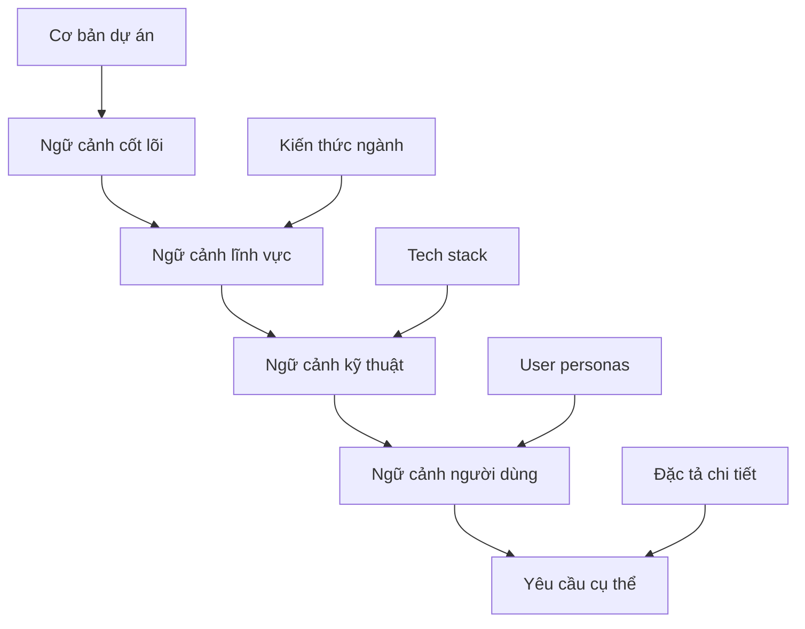

# 🎭 Module 2: Xác Định Bối Cảnh

Cung cấp **bối cảnh phong phú** là yếu tố then chốt để AI tạo ra kết quả phù hợp với lĩnh vực kinh doanh và yêu cầu của ngành. Kỹ thuật ngữ cảnh giúp AI "hiểu" được môi trường, ràng buộc, và kỳ vọng của dự án.

:::info 🎯 Mục Tiêu
Sau module này, BA sẽ có khả năng:
- ✅ Xây dựng **khung ngữ cảnh toàn diện** cho mọi dự án
- ✅ Định nghĩa **AI personas** phù hợp với chuyên môn lĩnh vực
- ✅ Tích hợp **tài liệu tham khảo** hiệu quả vào prompts
- ✅ Tối ưu hóa ngữ cảnh để đạt **độ chính xác theo lĩnh vực**
:::

---

## 🤔 Tại sao Kỹ Thuật Ngữ Cảnh quan trọng?

### 🏠 **Ví Dụ: Kiến Trúc Sư vs. Thợ Xây Thông Thường**

Hãy tưởng tượng việc yêu cầu một người xây nhà mà không cho họ biết:
- 🏔️ **Địa điểm:** Thành phố hay nông thôn? Khí hậu nào?
- 👨‍👩‍👧‍👦 **Gia đình:** Bao nhiêu người? Lối sống như thế nào?
- 💰 **Ngân sách:** Biệt thự cao cấp hay nhà ở bình dân?
- 🏗️ **Quy định:** Quy chuẩn xây dựng và yêu cầu tuân thủ?

**Kết quả:** Một ngôi nhà thông thường, không phù hợp với nhu cầu cụ thể.

### 📊 **Tác Động Của Chất Lượng Ngữ Cảnh:**

| Mức Độ Ngữ Cảnh | Chất Lượng Đầu Ra | Giá Trị Kinh Doanh | Ví Dụ |
|---------------|----------------|----------------|---------|
| **Không Ngữ Cảnh** | Thông thường (20%) | Thấp | "Tạo login flow" → Basic username/password |
| **Ngữ Cảnh Cơ Bản** | Chức năng (60%) | Trung bình | "Tạo login cho e-commerce" → Standard features |
| **Ngữ Cảnh Phong Phú** | Theo lĩnh vực (90%) | Cao | "Tạo login cho fintech với 2FA, KYC compliance" → Enterprise-grade |

---

## 🏗️ Các Thành Phần Khung Ngữ Cảnh

### 1️⃣ **Ngữ Cảnh Dự Án & Kinh Doanh**

#### 🏢 **Mẫu Thông Tin Dự Án:**
```
**Tên Dự Án:** [Tên mô tả + phiên bản]
**Lĩnh Vực Ngành:** [Fintech/E-commerce/Healthcare/EdTech/etc.]
**Mô Hình Kinh Doanh:** [B2B/B2C/B2B2C/Marketplace/SaaS/etc.]
**Giai Đoạn Công Ty:** [Startup/Scale-up/Enterprise/Legacy modernization]
**Phạm Vi Địa Lý:** [Cục bộ/Khu vực/Toàn cầu + thị trường chủ chốt]
**Môi Trường Quy Định:** [GDPR/HIPAA/PCI-DSS/SOX/etc.]
```

#### 🎯 **Mục Tiêu Kinh Doanh & KPIs:**
```
**Mục Tiêu Chính:**
- Doanh thu: [Mục tiêu tăng trưởng, tỷ lệ chuyển đổi]
- Trải nghiệm người dùng: [NPS, điểm hài lòng của người dùng]
- Vận hành: [Cải thiện hiệu quả, giảm chi phí]
- Tuân thủ: [Yêu cầu quy định, sẵn sàng kiểm tra]

**Chỉ Số Thành Công:**
- [KPIs có thể đo lường với giá trị mục tiêu]
- [Kỳ vọng về thời gian và mốc quan trọng]
```

#### 💡 **Ví Dụ Thực Tế:**
```
**Dự Án:** MegaBank Digital Transformation - Phase 2
**Ngành:** Fintech (Traditional Banking)
**Mô Hình Kinh Doanh:** B2C Digital Banking Platform
**Giai Đoạn Công Ty:** Enterprise (Legacy modernization)
**Phạm Vi Địa Lý:** Southeast Asia (Vietnam, Thailand, Singapore)
**Môi Trường Quy Định:** Central Bank regulations, PCI-DSS Level 1, ISO 27001

**Mục Tiêu Chính:**
- Tăng tỷ lệ sử dụng digital từ 30% lên 75% trong 18 tháng
- Giảm 40% cuộc gọi dịch vụ khách hàng
- Đạt 99.9% uptime SLA
- Tuân thủ đầy đủ quy định Open Banking mới
```

---

### 2️⃣ **Ngữ Cảnh Kỹ Thuật**

#### 🛠️ **Ngăn Xếp Công Nghệ:**
```
**Frontend:** [React/Angular/Vue + mobile apps]
**Backend:** [Microservices/Monolith + languages]
**Database:** [SQL/NoSQL + specific technologies]
**Cloud Platform:** [AWS/Azure/GCP + services used]
**Integration:** [APIs, third-party services, legacy systems]
**Security:** [Authentication, authorization, encryption standards]
```

#### 🏗️ **Mẫu Kiến Trúc:**
```
**Kiến Trúc Hệ Thống:** [Event-driven/Microservices/Serverless/etc.]
**Kiến Trúc Dữ Liệu:** [Real-time/Batch processing/Data lake/etc.]
**Kiến Trúc Bảo Mật:** [Zero-trust/Defense in depth/etc.]
**Triển Khai:** [CI/CD pipelines, containerization, orchestration]
```

---

### 3️⃣ **Ngữ Cảnh Người Dùng**

#### 👥 **Personas & Hành Trình Người Dùng:**
```
**Người Dùng Chính:**
- [Persona 1]: [Thông tin nhân khẩu, paint point, mục tiêu, kỹ năng công nghệ]
- [Persona 2]: [Vai trò, trách nhiệm, quyền ra quyết định]

**Các Giai Đoạn Hành Trình Người Dùng:**
- Nhận thức → Cân nhắc → Thử nghiệm → Mua hàng → Onboarding → Sử dụng → Ủng hộ

**Thiết Bị & Ưu Tiên Kênh:**
- Mobile-first (70%) vs Desktop (30%)
- Kênh giao tiếp ưa thích
- Yêu cầu khả năng tiếp cận
```

#### 🌍 **Bản Địa Hóa & Ngữ Cảnh Văn Hóa:**
```
**Ngôn Ngữ:** [Ngôn ngữ chính + ngôn ngữ phụ]
**Cân Nhắc Văn Hóa:** [Phong tục địa phương, thực hành kinh doanh]
**Yêu Cầu Pháp Lý:** [Quyền riêng tư dữ liệu, bảo vệ người tiêu dùng]
**Phương Thức Thanh Toán:** [Ưu tiên thanh toán địa phương, tiền tệ]
```

---

## 🎭 Định Nghĩa AI Persona

### 🎯 **Danh Mục Persona:**

| Loại Persona | Tập Trung Chuyên Môn | Tốt Nhất Cho |
|--------------|-----------------|----------|
| **Chuyên Gia Lĩnh Vực** | Kiến thức ngành | Yêu cầu kinh doanh, tuân thủ |
| **Kiến Trúc Sư Kỹ Thuật** | Thiết kế hệ thống | Đặc tả kỹ thuật, APIs |
| **Chuyên Gia UX** | Trải nghiệm người dùng | Luồng người dùng, thiết kế giao diện |
| **Kỹ Sư QA** | Đảm bảo chất lượng | Kịch bản test, trường hợp biên |
| **Chuyên Gia Chiến Lược Sản Phẩm** | Chiến lược kinh doanh | Ưu tiên tính năng, lộ trình |

### 💼 **Mẫu Định Nghĩa Persona:**

#### 🏦 **Fintech Domain Expert:**
```
"Đóng vai một Senior Business Analyst với 10 năm kinh nghiệm trong ngành fintech, 
chuyên sâu về:
- Payment systems (card processing, digital wallets, cryptocurrency)
- Regulatory compliance (PCI-DSS, PSD2, Open Banking, AML/KYC)
- Risk management và fraud detection
- Customer onboarding và identity verification
- Financial product design (lending, investment, insurance)

Background: Đã làm việc tại 2 ngân hàng lớn và 1 fintech unicorn, có experience 
với cả traditional banking và modern digital solutions."
```

#### 🛒 **E-commerce Product Owner:**
```
"Hãy là một Product Owner của e-commerce platform với 8 năm kinh nghiệm, 
chuyên về:
- Conversion optimization và user journey mapping
- Inventory management và supply chain integration
- Payment gateway integration và fraud prevention
- Personalization và recommendation engines
- Mobile commerce và omnichannel experience

Background: Đã scale 3 e-commerce platforms từ startup đến $100M+ revenue, 
expert về growth hacking và data-driven product decisions."
```

---

## 📚 Tích Hợp Tài Liệu Tham Khảo

### 📋 **Loại Tài Liệu & Cách Sử Dụng:**

| Loại Tài Liệu | Sử Dụng AI | Phương Pháp Tích Hợp |
|---------------|----------|-------------------|
| **User Stories** | Phân tích yêu cầu | Copy-paste từ Jira/Azure DevOps |
| **Tài Liệu API** | Đặc tả kỹ thuật | Swagger/OpenAPI schemas |
| **Quy Tắc Kinh Doanh** | Xác thực logic | Tài liệu chính sách, bảng quyết định |
| **Wireframes/Mockups** | Ngữ cảnh UI/UX | Link Figma, mô tả ảnh chụp màn hình |
| **Mô Hình Dữ Liệu** | Thiết kế database | Sơ đồ ERD, định nghĩa trường |
| **Tài Liệu Hiện Có** | Kiểm tra tính nhất quán | Hướng dẫn style, templates |

### 🔗 **Thực Hành Tích Hợp Tốt Nhất:**

#### ✅ **Tích Hợp Tham Khảo Hiệu Quả:**
```
**Câu chuyện người dùng hiện tại:**
"Là khách hàng cao cấp, tôi muốn tiếp cận các ưu đãi độc quyền
để có thể tiết kiệm tiền khi mua sắm thường xuyên."

**Bối cảnh bổ sung cho AI:**
- Hạng cao cấp: Khách hàng có chi tiêu hàng tháng trên 500 đô la
- Ưu đãi độc quyền: Giảm giá thêm 10-20% cho các mặt hàng đã chọn
- Tần suất: Ưu đãi mới vào mỗi thứ Ba và thứ Sáu
- Cá nhân hóa: Dựa trên lịch sử mua hàng và sở thích
- Hạn chế kỹ thuật: Phải tích hợp với API hệ thống khách hàng thân thiết hiện có
```

#### ❌ **Tích Hợp Tham Khảo Kém:**
```
"Dựa trên user story này: [dán văn bản dài, không có cấu trúc, không có ngữ cảnh]
Tạo tài liệu."
```

---

## 🎯 Chiến Lược Tối Ưu Hóa Ngữ Cảnh

### 📊 **Cách Tiếp Cận Phân Lớp Ngữ Cảnh:**



### 🎚️ **Mức Độ Chi Tiết Ngữ Cảnh:**

| Cấp Độ | Độ Sâu Thông Tin | Trường Hợp Sử Dụng | Ví Dụ |
|-------|------------------|-----------|---------|
| **Cấp Cao** | Tổng quan chiến lược | Tóm tắt điều hành | "Ứng dụng ngân hàng di động Fintech" |
| **Cấp Trung** | Chi tiết chức năng | Đặc tả tính năng | "KYC onboarding với xác thực tài liệu" |
| **Chi Tiết** | Đặc tả triển khai | Yêu cầu kỹ thuật | "Quét ID dựa trên OCR với độ chính xác 99.5%" |

### 🔧 **Danh Sách Kiểm Tra Xác Thực Ngữ Cảnh:**

- [ ] **Tính Đầy Đủ:** Có đủ thông tin để AI hiểu requirements?
- [ ] **Tính Chính Xác:** Thông tin có chính xác và cập nhật?
- [ ] **Tính Liên Quan:** Ngữ cảnh có liên quan trực tiếp đến nhiệm vụ?
- [ ] **Tính Nhất Quán:** Không có thông tin mâu thuẫn?
- [ ] **Tính Hành Động:** AI có thể sử dụng ngữ cảnh để tạo đầu ra?

---

## 🚀 Kỹ Thuật Ngữ Cảnh Nâng Cao

### 🎯 **Ngữ Cảnh Đa Bên Liên Quan:**
```
**Góc Nhìn Các Bên Liên Quan:**
- **Kinh Doanh:** Tác động doanh thu, định vị thị trường
- **Kỹ Thuật:** Khả năng mở rộng, duy trì, bảo mật
- **Người Dùng:** Khả năng sử dụng, khả năng tiếp cận, hiệu suất
- **Tuân Thủ:** Yêu cầu quy định, kiểm tra audit
- **Vận Hành:** Giám sát, hỗ trợ, bảo trì
```

### 🔄 **Tiến Hóa Ngữ Cảnh:**
```
**Giai đoạn 1 (MVP):** Chức năng cơ bản, luồng người dùng chính
**Giai đoạn 2 (Tăng trưởng):** Tính năng nâng cao, tích hợp
**Giai đoạn 3 (Mở rộng):** Tối ưu hóa, tính năng doanh nghiệp
**Giai đoạn 4 (Trưởng thành):** AI/ML, phân tích dự đoán
```

:::tip 💡 PRO TIP
- **Bắt Đầu Rộng, Sau Đó Thu Hẹp:** Bắt đầu với ngữ cảnh cấp cao, sau đó đi sâu
- **Sử Dụng Templates:** Chuẩn hóa thu thập ngữ cảnh để đảm bảo tính nhất quán
- **Kiểm Soát Phiên Bản:** Theo dõi thay đổi ngữ cảnh khi yêu cầu phát triển
- **Đánh Giá Bên Liên Quan:** Xác thực ngữ cảnh với các chuyên gia lĩnh vực
:::

---

## 🎯 Bài Tập Thực Hành

### 📝 **Thử Thách Xây Dựng Ngữ Cảnh:**
Bạn được giao nhiệm vụ tạo tài liệu cho tính năng "Reset Mật Khẩu" của một nền tảng chăm sóc sức khỏe. Hãy xây dựng khung ngữ cảnh toàn diện:

```
[Hãy tự thực hành và so sánh với solution ở module tiếp theo!]
```

:::danger 🔒 Ngữ Cảnh Bảo Mật
Trong các dự án nhạy cảm (fintech, healthcare, government), **không bao giờ bao gồm dữ liệu nhạy cảm thực tế** trong prompts. Sử dụng ví dụ ẩn danh và kịch bản chung để bảo vệ tính bảo mật.
:::

---

**🚀 Sẵn sàng cho Module 3?** Tiếp tục với **[Diễn đạt Yêu cầu](/gpt-for-technical-docs/prompt-for-ba/crafting-the-task)** để học cách cấu trúc nhiệm vụ hiệu quả! 