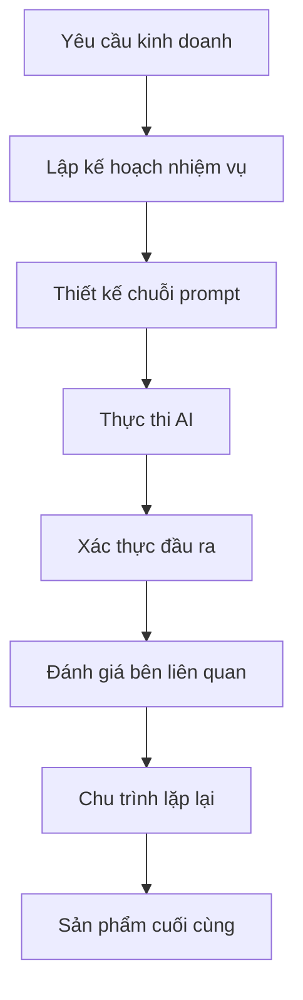

# ✍️ Module 3: Diễn Đạt Yêu Cầu

Sau khi đã thiết lập bối cảnh phong phú, bước tiếp theo là **tạo ra các nhiệm vụ rõ ràng, khả thi** mà AI có thể thực hiện một cách chính xác. Việc tạo nhiệm vụ là nghệ thuật biến yêu cầu kinh doanh thành hướng dẫn cho AI.

:::info 🎯 Mục Tiêu
Sau module này, BA sẽ có khả năng:
- ✅ Sử dụng **động từ** để tạo tạo ra prompt tốt
- ✅ Áp dụng **phương pháp Chain of Thought** cho các nhiệm vụ phức tạp
- ✅ **Phân tách** yêu cầu lớn thành các nhiệm vụ phụ dễ quản lý
- ✅ Cấu trúc nhiệm vụ để đạt **hiệu suất AI tối đa**
:::

---

## ⚡ Khung Động Từ

### 🎯 **Danh Mục Hành Động & Trường Hợp Sử Dụng:**

| Danh Mục | Động Từ | Bối Cảnh Kinh Doanh | Ví Dụ Đầu Ra |
|----------|-------|------------------|----------------|
| **📝 Tạo** | Tạo, Xây dựng, Thiết kế, Phát triển | Tài liệu mới, quy trình | User stories, wireframes, đặc tả |
| **🔍 Phân Tích** | Phân tích, Đánh giá, So sánh, Kiểm tra | Phân tích yêu cầu | Phân tích khoảng trống, đánh giá tác động |
| **🔄 Chuyển Đổi** | Chuyển đổi, Viết lại, Cải thiện, Tối ưu | Tối ưu hóa nội dung | Chuyển đổi định dạng, cải thiện ngôn ngữ |
| **📊 Sinh Ra** | Sinh ra, Liệt kê, Enumerate, Produce | Dữ liệu có cấu trúc | Test cases, checklists, ma trận |
| **🎨 Hình Tượng Hóa** | Vẽ, Minh họa, Mô tả, Diagram | Tài liệu trực quan | Flowcharts, sequence diagrams |
| **✅ Xác Thực** | Kiểm tra, Xác thực, Review, Audit | Đảm bảo chất lượng | Kiểm tra tuân thủ, đánh giá tính nhất quán |

### 💪 **Mẫu cấu trúc:**

#### ✅ **Mẫu Prompt Mạnh:**
```
[ĐỘNG TỪ] + [ĐỐI TƯỢNG CỤ THỂ] + [BỐI CẢNH] + [RÀNG BUỘC] + [TIÊU CHÍ THÀNH CÔNG]

Ví dụ:
"Tạo một bảng so sánh tính năng cho 3 cổng thanh toán (Stripe, PayPal, VNPay) 
trong bối cảnh của e-commerce B2C, tập trung vào độ phức tạp tích hợp, 
phí giao dịch, và các quốc gia được hỗ trợ. 
Bao gồm khuyến nghị dựa trên ưu tiên kinh doanh."
```

#### ❌ **Mẫu Prompt Yếu:**
```
"Tôi cần thông tin về cổng thanh toán."
"Làm tài liệu về thanh toán."
"Giúp tôi với tích hợp thanh toán."
```

---

## 🧠 Phương Pháp Chain of Thought

### 🔗 **Khung CoT:**


### 🎯 **Phân Tách Từng Bước:**

#### 📋 **Ví Dụ: Tài Liệu Luồng Checkout E-commerce**

**❌ Tiếp Cận Prompt Đơn:**
```
"Tạo tài liệu cho toàn bộ quy trình checkout của e-commerce website."
```

**✅ Tiếp Cận Chain of Thought:**

**Prompt 1 - Khám phá:**
```
Đóng vai Senior UX Analyst cho nền tảng e-commerce.
Phân tích và liệt kê tất cả các điểm tiếp xúc trong hành trình checkout của khách hàng, 
từ "Thêm vào giỏ hàng" đến "Xác nhận đơn hàng".

Bao gồm:
- Hành động của người dùng tại mỗi bước
- Phản hồi hệ thống và xác thực
- Các điểm ma sát tiềm năng
- Luồng thay thế (checkout khách, phương thức thanh toán đã lưu)

Định dạng đầu ra: Danh sách đánh số với sub-bullets cho chi tiết.
```

**Prompt 2 - Đi Sâu:**
```
Dựa trên phân tích hành trình checkout ở trên, tạo đặc tả chi tiết 
cho bước "Xử lý thanh toán".

Bao gồm:
- Các trường đầu vào và quy tắc xác thực
- Tùy chọn phương thức thanh toán (thẻ tín dụng, ví điện tử, BNPL)
- Yêu cầu bảo mật (tuân thủ PCI, xác thực 3DS)
- Kịch bản xử lý lỗi
- Luồng chuyển hướng thành công/thất bại

Định dạng đầu ra: Tài liệu đặc tả kỹ thuật với tiêu chí chấp nhận.
```

**Prompt 3 - Hình Tượng Hóa:**
```
Vẽ sequence diagram bằng Mermaid syntax để minh họa luồng xử lý thanh toán
giữa các thành phần: Khách hàng, Frontend, Backend, Cổng thanh toán, Ngân hàng.

Bao gồm:
- Happy Case: Thanh toán thành công
- Kịch bản lỗi: Thẻ bị từ chối, timeout mạng
- Các bước bảo mật: Tạo token, xác thực 3DS
- Quy trình bất đồng bộ: Thông báo webhook, xác nhận đơn hàng
```

**Prompt 4 - Kịch Bản Test:**
```
Tạo ra các kịch bản test toàn diện cho xử lý thanh toán, bao gồm:
- Test chức năng: Đầu vào hợp lệ/không hợp lệ, điều kiện biên
- Test bảo mật: SQL injection, XSS, gian lận thanh toán
- Test hiệu suất: Khối lượng giao dịch cao, xử lý timeout
- Test tích hợp: Nhiều cổng thanh toán, độ tin cậy webhook

Định dạng đầu ra: Bảng test case với các cột: Kịch bản, Bước, Kết quả mong đợi, Ưu tiên.
```

---

## 🏗️ Mẫu Kiến Trúc Nhiệm Vụ

### 🎯 **Mẫu 1: Mở Rộng Tiệm Tiến**

```
Cấp 1: Tổng quan cấp cao
Cấp 2: Phân tách chức năng
Cấp 3: Chi tiết kỹ thuật
Cấp 4: Đặc tả triển khai
```

**Ví Dụ Ứng Dụng:**
```
C1: "Mô tả quy trình onboarding người dùng cho ứng dụng fintech"
C2: "Chi tiết các bước xác minh KYC trong onboarding"
C3: "Chỉ định yêu cầu tải lên tài liệu và xác thực OCR"
C4: "Định nghĩa API endpoints và mô hình dữ liệu cho xử lý tài liệu"
```

### 🎯 **Mẫu 2: Phân Tích Đa Góc Nhìn**

```
Góc nhìn 1: Quan điểm bên liên quan kinh doanh
Góc nhìn 2: Quan điểm triển khai kỹ thuật
Góc nhìn 3: Quan điểm trải nghiệm người dùng
Góc nhìn 4: Quan điểm tuân thủ/bảo mật
```

### 🎯 **Mẫu 3: Khám Phá Dựa Trên Kịch Bản**

```
Kịch bản 1: Happy Case (90% trường hợp)
Kịch bản 2: Luồng thay thế (8% trường hợp)  
Kịch bản 3: Trường hợp biên và xử lý lỗi (2% trường hợp)
```

---

## 📋 Mẫu Đặc Tả Nhiệm Vụ

### 🎯 **Mẫu 1: Tài Liệu Tính Năng**

```
**Nhiệm vụ:** Tạo tài liệu tính năng toàn diện cho [TÊN_TÍNH_NĂNG]

**Bối cảnh:**
- Dự án: [BỐI_CẢNH_DỰ_ÁN]
- Người dùng: [NGƯỜI_DÙNG_MỤC_TIÊU]
- Mục tiêu kinh doanh: [CÁC_MỤC_TIÊU]

**Yêu cầu:**
1. Tổng quan tính năng và giá trị kinh doanh
2. User stories với tiêu chí chấp nhận
3. Yêu cầu chức năng với các trường hợp biên
4. Đặc tả kỹ thuật (APIs, mô hình dữ liệu)
5. Hướng dẫn UI/UX với wireframes
6. Kịch bản test và tiêu chí chất lượng

**Định dạng đầu ra:** 
- Tài liệu Markdown với các phần có cấu trúc
- Bao gồm sơ đồ (cú pháp Mermaid)
- Sẵn sàng để bàn giao cho developer

**Tiêu chí thành công:**
- Bao phủ đầy đủ nhu cầu người dùng
- Tính khả thi kỹ thuật được xác thực
- Yêu cầu tuân thủ được giải quyết
```

### 🎯 **Mẫu 2: Tài Liệu Quy Trình**

```
**Nhiệm vụ:** Tài liệu hóa quy trình kinh doanh end-to-end cho [TÊN_QUY_TRÌNH]

**Phạm vi:**
- Trigger khởi động: [SỰ_KIỆN_KÍCH_HOẠT]
- Trạng thái kết thúc: [TIÊU_CHÍ_HOÀN_THÀNH]
- Bên liên quan: [CÁC_BÊN_THAM_GIA]

**Khung phân tích:**
1. Đánh giá trạng thái hiện tại (As-Is)
2. Xác định paint point và sự kém hiệu quả
3. Thiết kế trạng thái tương lai (To-Be)
4. Phân tích khoảng trống và lộ trình triển khai
5. Chỉ số thành công và KPIs

**Sản phẩm bàn giao:**
- Lưu đồ quy trình (ký hiệu BPMN)
- Ma trận trách nhiệm bên liên quan (RACI)
- Điểm tích hợp hệ thống
- Đánh giá rủi ro và chiến lược giảm thiểu
```

---

## 🎯 Kỹ Thuật Tạo Nhiệm Vụ Nâng Cao

### 🔧 **Kỹ Thuật 1: Thiết Kế Dựa Trên Ràng Buộc**

```
**Ràng buộc kỳ vọng (Những gì cần bao gồm):**
- Phải tuân thủ yêu cầu GDPR
- Nên tích hợp với hệ thống CRM hiện có
- Phải hỗ trợ thiết kế mobile-first

**Ràng buộc sai (Những gì cần tránh):**
- Không lưu trữ dữ liệu nhạy cảm trong cookies
- Tránh các form đa bước phức tạp
- Không có script theo dõi bên thứ ba
```

### 🔧 **Kỹ Thuật 2: Hướng Dẫn Theo Persona Cụ Thể**

```
**Cho Đối Tượng Kỹ Thuật:**
"Tập trung vào đặc tả API, schema dữ liệu, yêu cầu hiệu suất"

**Cho Đối Tượng Kinh Doanh:**  
"Nhấn mạnh ROI, tác động người dùng, lợi thế cạnh tranh"

**Cho Đội Tuân Thủ:**
"Nổi bật yêu cầu quy định, kiểm tra audit, giảm thiểu rủi ro"
```

### 🔧 **Kỹ Thuật 3: Prompts Tinh Chỉnh Lặp Lại**

```
**Chuỗi Prompt:**
1. "Tạo bản thảo ban đầu của [TÀI_LIỆU]"
2. "Xem xét và xác định khoảng trống trong bản thảo trên"
3. "Cải thiện bản thảo với các yếu tố còn thiếu đã xác định"
4. "Xác thực phiên bản cuối cùng với [TIÊU_CHÍ]"
```

---

## ⚠️ Lỗi Thường Gặp Khi Tạo Nhiệm Vụ

### 🚨 **Top 5 Lỗi:**

| Lỗi | Tác Động | Giải Pháp |
|---------|--------|----------|
| **Mục tiêu mơ hồ** | Đầu ra chung chung, không sử dụng được | Định nghĩa mục tiêu cụ thể, có thể đo lường |
| **Quá nhiều nhiệm vụ trong một** | Kết quả choáng ngợp, không đầy đủ | Chia thành các nhiệm vụ phụ tập trung |
| **Thiếu tiêu chí thành công** | Không có tiêu chuẩn chất lượng | Định nghĩa tiêu chí chấp nhận rõ ràng |
| **Bỏ qua phụ thuộc** | Mâu thuẫn logic | Lập bản đồ mối quan hệ nhiệm vụ |
| **Không có kế hoạch lặp lại** | Nỗ lực đầu tiên không tối ưu | Xây dựng chu trình tinh chỉnh |

### 🔧 **Danh Sách Kiểm Tra Chất Lượng:**

- [ ] **Rõ ràng:** Hướng dẫn nhiệm vụ không mơ hồ
- [ ] **Đầy đủ:** Tất cả yêu cầu được chỉ định
- [ ] **Khả thi:** AI có thể thực hiện nhiệm vụ một cách thực tế
- [ ] **Có thể đo lường:** Tiêu chí thành công có thể định lượng
- [ ] **Liên quan:** Nhiệm vụ phù hợp với mục tiêu kinh doanh

---

## 🎯 Bài Tập Thực Hành

### 📝 **Bài Tập 1: Phân Tách Nhiệm Vụ**

**Kịch bản:** Bạn cần tạo tài liệu cho tính năng "Quản lý hồ sơ người dùng" của nền tảng mạng xã hội.

**Thử thách:** Chia nhỏ điều này thành 4-5 prompts tập trung sử dụng phương pháp Chain of Thought.

```
[Giải pháp của bạn ở đây - so sánh với cách tiếp cận chuyên gia trong module tiếp theo!]
```

### 📝 **Bài Tập 2: Phân Tích Đa Góc Nhìn**

**Kịch bản:** Tài liệu hóa tính năng "Cài đặt quyền riêng tư dữ liệu" từ 4 góc nhìn: Người dùng, Pháp lý, Kỹ thuật, Kinh doanh.

**Thử thách:** Tạo 4 prompts khác nhau, mỗi prompt được tối ưu hóa cho một góc nhìn bên liên quan.

```
[Giải pháp của bạn ở đây]
```

:::tip 💡 Mẹo Chuyên Nghiệp
- **Bắt đầu với TẠI SAO:** Luôn bắt đầu với bối cảnh kinh doanh và mục tiêu
- **Suy nghĩ theo lớp:** Xây dựng độ phức tạp dần dần qua nhiều prompts
- **Sử dụng mẫu:** Chuẩn hóa cấu trúc nhiệm vụ để đảm bảo tính nhất quán
- **Test lặp lại:** Tinh chỉnh prompts dựa trên chất lượng đầu ra AI
:::

---

## 🚀 Ứng Dụng Nâng Cao

### 🎯 **Điều Phối Nhiệm Vụ Cấp Doanh Nghiệp:**


:::danger 🔥 Yếu Tố Thành Công
**Chất lượng tạo nhiệm vụ tác động trực tiếp đến chất lượng đầu ra AI.** Đầu tư thời gian trong việc thiết kế prompts rõ ràng, toàn diện - điều này sẽ tiết kiệm thời gian đáng kể trong chu kỳ sửa đổi và cải thiện chất lượng sản phẩm cuối cùng.
:::

---

**🚀 Sẵn sàng cho Module 4?** Tiếp tục với **[Định dạng Đầu ra](/gpt-for-technical-docs/prompt-for-ba/specifying-the-output)** để làm chủ các kỹ thuật định dạng đầu ra! 