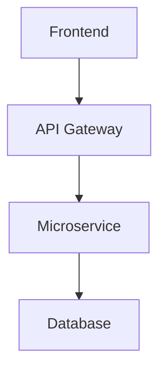
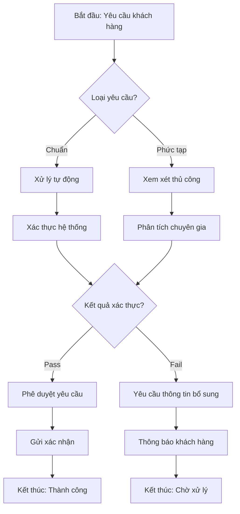
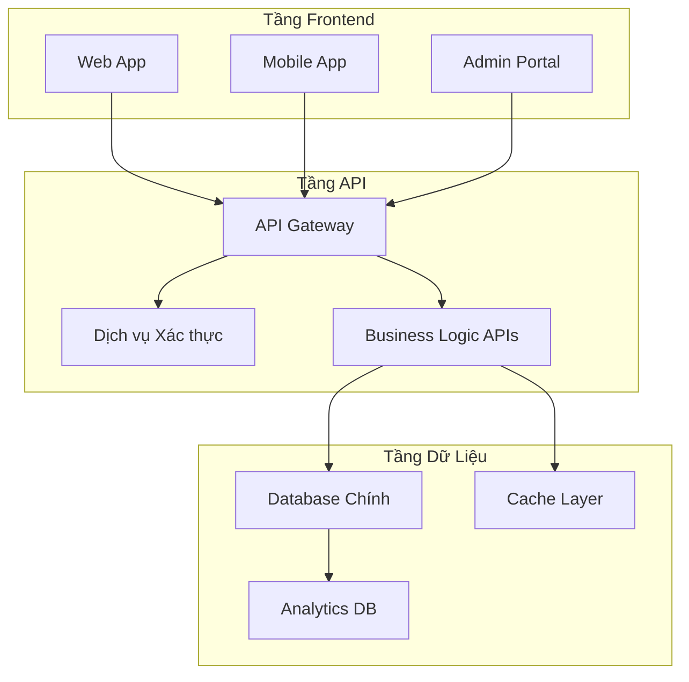
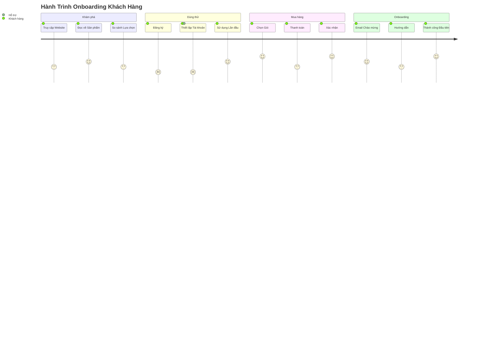
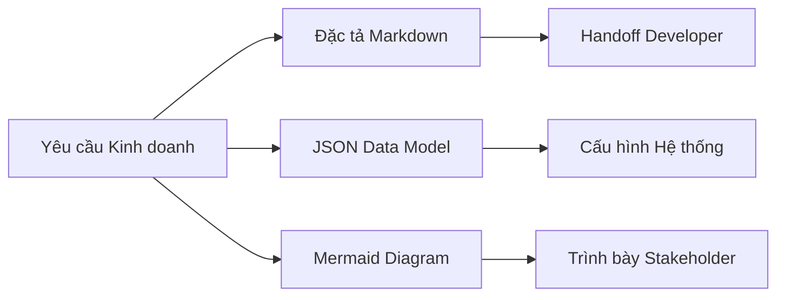

# 📋 Module 4: Định Dạng Đầu Ra

Yêu cầu AI trả về kết quả theo **định dạng có cấu trúc** là kỹ thuật then chốt để đảm bảo tính nhất quán, dễ sử dụng và dễ dàng tích hợp vào quy trình làm việc doanh nghiệp. Việc chỉ định định dạng đầu ra giúp biến output của AI từ văn bản thô thành các tài liệu kinh doanh có thể thực thi được.

:::info 🎯 Mục Tiêu
Sau module này, BA sẽ có khả năng:
- ✅ Thành thạo **5 định dạng đầu ra cốt lõi** cho tài liệu kinh doanh
- ✅ Thiết kế **template tùy chỉnh** phù hợp với tiêu chuẩn tổ chức
- ✅ Tích hợp output AI vào **quy trình hiện tại** một cách liền mạch
- ✅ Tối ưu hóa định dạng để đạt **mức độ chấp nhận tối đa** từ stakeholder
:::

---

## 🎯 Tại sao Định Dạng Đầu Ra lại Quan Trọng?

### 📊 **Phân Tích Tác Động:**

| Khía Cạnh | Đầu Ra Không Cấu Trúc | Đầu Ra Có Cấu Trúc | Tác Động |
|-----------|----------------------|-------------------|-------------------|
| **Thời Gian Tích Hợp** | 2-4 giờ format thủ công | 5-10 phút copy-paste | Tiết kiệm 90% thời gian |
| **Tính Nhất Quán** | Thay đổi theo cá nhân | Chuẩn hóa toàn team | Đồng bộ thương hiệu |
| **Mức Chấp Nhận** | 40% tỷ lệ sử dụng | 85% tỷ lệ sử dụng | ROI cao hơn |
| **Công Sức Bảo Trì** | Cao (cập nhật thủ công) | Thấp (dựa trên template) | Giảm chi phí vận hành |

### 🔄 **Chất Lượng Dựa Trên Định Dạng:**
Định dạng có cấu trúc **buộc AI phải tổ chức tư duy**, dẫn đến:
- **Tính Đầy Đủ:** Tất cả các phần bắt buộc phải được điền
- **Luồng Logic:** Thông tin tuân theo cấu trúc đã định sẵn
- **Tính Nhất Quán:** Cùng định dạng cho tất cả các tài liệu tương tự
- **Khả Năng Thực Thi:** Các bước tiếp theo và trách nhiệm rõ ràng

---

## 🛠️ Các Định Dạng Đầu Ra Cốt Lõi

### 1️⃣ **Markdown - Định Dạng Đa Năng**

**Phù Hợp Cho:** Tài liệu kỹ thuật, đặc tả kỹ thuật, hướng dẫn người dùng

#### 🎯 **Kỹ Thuật Markdown Nâng Cao:**

**Cấu Trúc Cơ Bản:**
```markdown
# Tiêu Đề Chính
## Tiêu Đề Phần
### Tiêu Đề Mục Con
- Danh sách gạch đầu dòng
1. Danh sách có số thứ tự
| Bảng | Với | Các Cột |
```

**Template Cấp Doanh Nghiệp:**
```markdown
# [Tên Tính Năng] - Đặc Tả Kỹ Thuật

## 📋 Tổng Quan
**Giá Trị Kinh Doanh:** [Tuyên bố ROI và tác động]
**Người Dùng Mục Tiêu:** [Persona chính và phụ]
**Dependencies:** [Điều kiện tiên quyết và tích hợp]

## 🎯 Yêu Cầu Chức Năng

### Tính Năng Cốt Lõi
| Tính Năng | Độ Ưu Tiên | Effort | Dependencies | Ghi Chú |
|-----------|------------|--------|--------------|---------|
| [Tính năng 1] | Cao | 5 ngày | [Hệ thống A] | [Bối cảnh bổ sung] |

### User Stories
**Epic:** [Tên và mô tả Epic]

**Story 1:** [Định dạng user story]
- **Tiêu Chí Chấp Nhận:**
  - [ ] [Tiêu chí có thể kiểm tra 1]
  - [ ] [Tiêu chí có thể kiểm tra 2]
- **Definition of Done:**
  - [ ] [Yêu cầu kỹ thuật]
  - [ ] [Yêu cầu chất lượng]

## 🏗️ Kiến Trúc Kỹ Thuật

### Các Thành Phần Hệ Thống


### Đặc Tả API
**Endpoint:** `POST /api/v1/users`
**Request Body:**
```json
{
  "name": "string",
  "email": "string",
  "role": "enum"
}
```

## 🧪 Chiến Lược Testing
- **Unit Tests:** [Yêu cầu coverage]
- **Integration Tests:** [Các kịch bản chính]
- **Performance Tests:** [Benchmarks]

## 📈 Metrics Thành Công
- **KPI 1:** [Phương pháp đo lường]
- **KPI 2:** [Giá trị mục tiêu]
```

---

### 2️⃣ **JSON - Định Dạng Dữ Liệu Có Cấu Trúc**

**Phù Hợp Cho:** File cấu hình, đặc tả API, mô hình dữ liệu

#### 🎯 **JSON Schemas Hướng Kinh Doanh:**

**Schema Phân Tích Yêu Cầu:**
```json
{
  "du_an": {
    "ten": "string",
    "phien_ban": "string",
    "stakeholders": ["string"]
  },
  "yeu_cau_chuc_nang": [
    {
      "id": "FR-001",
      "tieu_de": "string",
      "mo_ta": "string",
      "do_uu_tien": "Cao|Trung bình|Thấp",
      "uoc_tinh_effort": "number",
      "tieu_chi_chap_nhan": ["string"],
      "phu_thuoc": ["string"]
    }
  ],
  "yeu_cau_phi_chuc_nang": [
    {
      "danh_muc": "Hiệu năng|Bảo mật|Usability",
      "yeu_cau": "string",
      "phuong_phap_do": "string",
      "gia_tri_muc_tieu": "string"
    }
  ],
  "rui_ro": [
    {
      "mo_ta": "string",
      "xac_suat": "Cao|Trung bình|Thấp",
      "tac_dong": "Cao|Trung bình|Thấp",
      "giam_thieu": "string"
    }
  ]
}
```

**Schema User Journey:**
```json
{
  "hanh_trinh_nguoi_dung": {
    "persona": "string",
    "kich_ban": "string",
    "diem_tiep_xuc": [
      {
        "buoc": "number",
        "hanh_dong": "string",
        "kenh": "Web|Mobile|Email|Điện thoại",
        "diem_dau": ["string"],
        "co_hoi": ["string"],
        "cam_xuc": ["string"]
      }
    ],
    "metrics_thanh_cong": {
      "ty_le_hoan_thanh": "percentage",
      "diem_hai_long": "number",
      "thoi_gian_hoan_thanh": "duration"
    }
  }
}
```

---

### 3️⃣ **Mermaid Diagrams - Tài Liệu Trực Quan**

**Phù Hợp Cho:** Luồng quy trình, kiến trúc hệ thống, user journeys

#### 🎯 **Templates Diagram Doanh Nghiệp:**

**Luồng Quy Trình Kinh Doanh:**


**Kiến Trúc Hệ Thống:**


**Bản Đồ User Journey:**


---

### 4️⃣ **Bảng Có Cấu Trúc - Tổ Chức Dữ Liệu**

**Phù Hợp Cho:** So sánh tính năng, ma trận yêu cầu, test cases

#### 🎯 **Templates Bảng Doanh Nghiệp:**

**Ma Trận So Sánh Tính Năng:**
| Tính Năng | Trạng Thái Hiện Tại | Trạng Thái Đề Xuất | Tác Động | Effort Kỹ Thuật | Độ Ưu Tiên |
|-----------|-------------------|-------------------|-------------------|----------------|-----------|
| Xác thực Người dùng | Đăng nhập cơ bản | SSO + 2FA | Bảo mật tốt hơn, giảm ticket hỗ trợ | 8 ngày | Cao |
| Xuất Dữ liệu | CSV thủ công | Báo cáo tự động | Tiết kiệm thời gian, insights tốt hơn | 5 ngày | Trung bình |
| Truy cập Mobile | Responsive web | Native app | UX tốt hơn, khả năng offline | 20 ngày | Cao |

**Ma Trận Truy Xuất Nguồn Gốc Yêu Cầu:**
| ID Yêu Cầu | Nhu Cầu Kinh Doanh | User Story | Tiêu Chí Chấp Nhận | Test Case | Trạng Thái |
|------------|-------------------|------------|-------------------|-----------|----------|
| BR-001 | Giảm thời gian đăng nhập | US-001 | Đăng nhập < 2 giây | TC-001 | Đang tiến hành |
| BR-002 | Cải thiện độ chính xác dữ liệu | US-002 | 99.9% chính xác | TC-002 | Hoàn thành |

**Ma Trận Đánh Giá Rủi Ro:**
| Rủi Ro | Danh Mục | Xác Suất | Tác Động | Điểm Rủi Ro | Chiến Lược Giảm Thiểu | Chủ Sở Hữu |
|--------|----------|----------|----------|-------------|----------------------|-----------|
| Giới hạn API Rate | Kỹ thuật | Trung bình | Cao | 6 | Triển khai caching | Dev Team |
| Thay đổi Quy định | Tuân thủ | Thấp | Cao | 4 | Theo dõi cập nhật | Legal Team |

---

### 5️⃣ **Custom Templates - Tiêu Chuẩn Tổ Chức**

**Phù Hợp Cho:** Tài liệu đặc thù công ty, quy trình được chuẩn hóa

#### 🎯 **Framework Thiết Kế Template:**

**Template Business Case:**
```
**Business Case: [Tên Dự Án]**

**Tóm Tắt Điều Hành**
- Phát biểu Vấn đề: [Chúng ta đang giải quyết vấn đề kinh doanh gì?]
- Giải pháp Đề xuất: [Phương pháp tiếp cận tổng quan]
- Đầu tư Cần thiết: [Ngân sách và tài nguyên]
- ROI Dự kiến: [Lợi nhuận tài chính và timeline]

**Phân Tích Tình Trạng Hiện Tại**
- Quy trình Kinh doanh: [Cách thức hoạt động hiện tại]
- Điểm Đau: [Các vấn đề cụ thể và tác động của chúng]
- Tác Động Định Lượng: [Metrics thể hiện vấn đề]

**Giải Pháp Đề Xuất**
- Tổng quan Giải pháp: [Mô tả chi tiết]
- Tính năng Chính: [Khả năng cốt lõi]
- Phương pháp Triển khai: [Các giai đoạn và timeline]
- Tiêu chí Thành công: [Cách chúng ta đo lường thành công]

**Phân Tích Tài Chính**
- Phân tích Chi phí: [Phân tích chi phí chi tiết]
- Tác động Doanh thu: [Dự kiến tăng thu nhập]
- Tiết kiệm Chi phí: [Lợi ích hiệu quả vận hành]
- Tính toán ROI: [Công thức và dự báo]

**Đánh Giá Rủi Ro**
- Rủi ro Kỹ thuật: [Thách thức triển khai]
- Rủi ro Kinh doanh: [Rủi ro thị trường và vận hành]
- Chiến lược Giảm thiểu: [Cách chúng ta giải quyết từng rủi ro]

**Khuyến Nghị**
- Quyết định Go/No-Go: [Khuyến nghị rõ ràng]
- Các bước Tiếp theo: [Hành động ngay lập tức cần thiết]
- Timeline: [Các milestone và ngày quan trọng]
```

---

## 🎯 Tối Ưu Hóa Định Dạng Nâng Cao

### 🔧 **Chiến Lược Đa Định Dạng:**



### 📊 **Ma Trận Lựa Chọn Định Dạng:**

| Use Case | Định Dạng Chính | Định Dạng Phụ | Lý Do |
|----------|-----------------|---------------|-------|
| **Đặc tả Kỹ thuật** | Markdown | Mermaid | Văn bản chi tiết + luồng trực quan |
| **Tài liệu API** | JSON | Markdown | Dữ liệu có cấu trúc + ví dụ |
| **Quy trình Kinh doanh** | Mermaid | Bảng | Luồng trực quan + các bước chi tiết |
| **Yêu cầu** | Bảng | JSON | So sánh có cấu trúc + xuất dữ liệu |
| **User Stories** | Markdown | JSON | Định dạng kể chuyện + dữ liệu có cấu trúc |

### 🎨 **Tùy Chỉnh Template:**

```
**Template Prompt:**
"Sử dụng template sau và điền vào các placeholder:

**[CẤU_TRÚC_TEMPLATE]**

**Quy tắc Tùy chỉnh:**
- [YÊU_CẦU_ĐẶC_THÙ_CÔNG_TY]
- [TIÊU_CHUẨN_NGÀNH]
- [SỞ_THÍCH_STAKEHOLDER]

**Yêu cầu Đầu ra:**
- Định dạng: [ĐỊNH_DẠNG_ƯA_THÍCH]
- Độ dài: [KHOẢNG_SỐ_TỪ]
- Giọng điệu: [CHUYÊN_NGHIỆP/KỸ_THUẬT/KINH_DOANH]"
```

---

## 🚀 Chiến Lược Tích Hợp

### 🔗 **Tích Hợp Workflow:**

| Công Cụ | Định Dạng | Phương Pháp Tích Hợp | Lợi Ích |
|---------|-----------|---------------------|---------|
| **Jira** | JSON → Custom Fields | Import API | Tạo ticket tự động |
| **Confluence** | Markdown → Wiki | Paste trực tiếp | Tài liệu nhất quán |
| **Figma** | Mermaid → Diagrams | Chuyển đổi plugin | Đồng bộ trực quan |
| **Excel** | Bảng → Spreadsheet | Xuất CSV | Phân tích dữ liệu |
| **PowerPoint** | Tất cả định dạng → Slides | Mapping template | Trình bày điều hành |

### 📋 **Framework Đảm Bảo Chất Lượng:**

```
**Checklist Xác Thực Định Dạng:**
- [ ] Tất cả các phần bắt buộc có
- [ ] Kiểu dữ liệu khớp với đặc tả
- [ ] Định dạng nhất quán với tiêu chuẩn
- [ ] Liên kết và tham chiếu hoạt động
- [ ] Stakeholder đã review hoàn tất
- [ ] Version control đã cập nhật
```

---

## 🎯 Bài Tập Thực Hành

### 📝 **Bài Tập 1: Tài Liệu Đa Định Dạng**

**Kịch Bản:** Tạo tài liệu cho "Hệ Thống Ticket Hỗ Trợ Khách Hàng" sử dụng 3 định dạng khác nhau.

**Thách Thức:** 
1. **Markdown:** Đặc tả kỹ thuật
2. **JSON:** Định nghĩa mô hình dữ liệu
3. **Mermaid:** Diagram luồng quy trình

```
[Giải pháp của bạn ở đây - so sánh với ví dụ chuyên gia!]
```

### 📝 **Bài Tập 2: Thiết Kế Template Tùy Chỉnh**

**Kịch Bản:** Thiết kế template tùy chỉnh cho quy trình "Đánh Giá Yêu Cầu Tính Năng" tại công ty của bạn.

**Yêu Cầu:**
- Phải bao gồm đánh giá tác động
- Phân tích tính khả thi kỹ thuật
- Yêu cầu tài nguyên
- Ước tính timeline

```
[Thiết kế template của bạn ở đây]
```

:::tip 💡 Mẹo Chuyên Nghiệp
- **Bắt đầu Đơn giản:** Khởi đầu với các định dạng cơ bản, dần dần thêm độ phức tạp
- **Test Tích hợp:** Xác thực định dạng hoạt động với các công cụ hiện có
- **Thu thập Phản hồi:** Lặp lại dựa trên patterns sử dụng của stakeholder
- **Duy trì Tiêu chuẩn:** Giữ cho thư viện định dạng được cập nhật và nhất quán
:::

---
:::danger 🔥 Yếu Tố Thành Công
**Tính nhất quán của định dạng thúc đẩy việc chấp nhận.** Định dạng không nhất quán dẫn đến nhầm lẫn và giảm sự ủng hộ của stakeholder. Hãy đầu tư vào việc tạo và duy trì các tiêu chuẩn định dạng.
:::

---

**🚀 Sẵn sàng cho Module Cuối?** Tiếp tục với **[Ví dụ & Workflows](/gpt-for-technical-docs/prompt-for-ba/examples-and-workflows)** để xem tất cả mọi thứ kết hợp với nhau trong các kịch bản thực tế! 