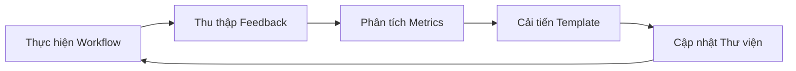

# 🛠️ Module 5: Ví Dụ Thực Tế và Workflows

Phần này tổng hợp **tất cả 4 modules** trước đó vào các case studies thực tế, demonstrating quy trình từ đầu đến cuối từ yêu cầu kinh doanh đến sản phẩm cuối cùng. Đây là nơi lý thuyết gặp gỡ thực hành.

:::info 🎯 Mục Tiêu Học Tập
Sau module này, BA sẽ có khả năng:
- ✅ Thực hiện **quy trình tài liệu hoàn chỉnh** sử dụng AI
- ✅ Áp dụng **kỹ thuật prompt chaining nâng cao** cho các dự án phức tạp
- ✅ Điều chỉnh workflows cho **các ngữ cảnh ngành khác nhau**
- ✅ Xây dựng **thư viện prompt tái sử dụng** cho tổ chức
:::

---

## 🏪 Case Study 1: Nền Tảng E-commerce

### 📋 **Bối Cảnh Dự Án**
- **Công ty:** MegaShop (E-commerce cỡ trung, doanh thu $50M)
- **Ngành:** B2C Retail, Thời trang & Điện tử
- **Thách thức:** Hiện đại hóa quy trình thanh toán legacy
- **Timeline:** Triển khai 3 tháng
- **Stakeholders:** Product, Engineering, UX, Legal, Finance

### 🎯 **Mục Tiêu Kinh Doanh**
Giảm tỷ lệ bỏ giỏ hàng từ 68% xuống 45% bằng cách tối ưu hóa trải nghiệm thanh toán và triển khai các phương thức thanh toán hiện đại.

---

### 🚀 **Thực Hiện Workflow**

#### **Giai Đoạn 1: Khám Phá Yêu Cầu**

**Prompt 1.1 - Phân Tích Stakeholder:**
```
Đóng vai một Senior Business Analyst với 8 năm kinh nghiệm trong e-commerce.

**Bối cảnh:**
- Công ty: MegaShop (doanh thu $50M, B2C thời trang & điện tử)
- Vấn đề: Tỷ lệ bỏ giỏ hàng 68% (trung bình ngành 45%)
- Mục tiêu: Hiện đại hóa quy trình thanh toán trong 3 tháng
- Thanh toán hiện tại: Quy trình 5 bước, tùy chọn thanh toán hạn chế

**Nhiệm vụ:**
Phân tích và lập bản đồ tất cả stakeholders cho dự án hiện đại hóa thanh toán.

**Định dạng đầu ra:**
Bảng Markdown với các cột:
- Stakeholder | Vai trò | Quan tâm/Lo ngại | Mức độ Ảnh hưởng | Chiến lược Tương tác

**Bao gồm:**
- Stakeholders nội bộ (Product, Engineering, UX, Legal, Finance)
- Stakeholders bên ngoài (Nhà cung cấp thanh toán, kiểm toán tuân thủ)
- Người dùng cuối (các phân khúc khách hàng khác nhau)
```

**Prompt 1.2 - Phân Tích Tình Trạng Hiện Tại:**
```
Tiếp tục với vai trò Senior BA cho dự án thanh toán MegaShop.

**Nhiệm vụ:**
Phân tích quy trình thanh toán hiện tại và xác định các điểm đau cụ thể gây ra tỷ lệ bỏ hàng 68%.

**Quy Trình Hiện Tại (5 bước):**
1. Xem lại Giỏ hàng
2. Quyết định Khách/Đăng nhập
3. Thông tin Giao hàng
4. Thông tin Thanh toán
5. Xác nhận Đơn hàng

**Framework Phân tích:**
- Lập bản đồ user journey với các điểm ma sát
- Tác động định lượng của từng điểm đau
- Phân tích ràng buộc kỹ thuật
- Benchmarking đối thủ (top 3 competitors)

**Định dạng đầu ra:**
1. Sơ đồ quy trình hiện tại (Mermaid)
2. Bảng phân tích điểm đau
3. Ma trận so sánh đối thủ
4. Đánh giá tác động kinh doanh định lượng
```

#### **Giai Đoạn 2: Thiết Kế Giải Pháp**

**Prompt 2.1 - Thiết Kế Trạng Thái Tương Lai:**
```
Dựa trên phân tích tình trạng hiện tại, thiết kế trải nghiệm thanh toán tối ưu.

**Nguyên Tắc Thiết Kế:**
- Mobile-first (70% lưu lượng truy cập)
- Tối ưu hóa thanh toán khách
- Thu thập dữ liệu dần dần
- Phương thức thanh toán hiện đại (Apple Pay, Google Pay, BNPL)
- Tín hiệu tin cậy trong suốt quy trình

**Yêu cầu:**
1. Giảm các bước từ 5 xuống 3
2. Triển khai tùy chọn thanh toán một trang
3. Thêm làn thanh toán nhanh cho khách
4. Tích hợp 3 phương thức thanh toán hiện đại
5. Duy trì tuân thủ PCI

**Đầu ra:**
- Luồng quy trình trạng thái tương lai (Mermaid)
- Bảng đặc tả tính năng
- Epic user story với tiêu chí chấp nhận
- Yêu cầu tích hợp kỹ thuật
- Định nghĩa metrics thành công
```

**Prompt 2.2 - Lộ Trình Triển Khai:**
```
Tạo lộ trình triển khai chi tiết cho hiện đại hóa thanh toán.

**Ràng buộc:**
- Timeline 3 tháng
- Team Engineering: 4 developers
- Ngân sách: $200K
- Phải duy trì uptime 99.9% trong quá trình chuyển đổi
- Đóng băng mùa lễ (15/11 - 15/1)

**Deliverables:**
1. Phân chia giai đoạn với dependencies
2. Kế hoạch phân bổ tài nguyên
3. Đánh giá rủi ro với biện pháp giảm thiểu
4. Chiến lược go-live
5. Quy trình rollback

**Định dạng:** Template lộ trình dự án với biểu diễn Gantt chart
```

#### **Giai Đoạn 3: Đặc Tả Kỹ Thuật**

**Prompt 3.1 - Thiết Kế API:**
```
Thiết kế đặc tả API cho hệ thống thanh toán mới.

**Bối Cảnh Kỹ Thuật:**
- Kiến trúc Microservices
- REST APIs với JSON
- Tích hợp với: Stripe, PayPal, Klarna, Shopify Payments
- Kiểm tra inventory real-time
- Dịch vụ phát hiện gian lận

**Yêu cầu:**
Tài liệu hóa APIs cho:
1. Quản lý giỏ hàng (thêm/xóa/cập nhật items)
2. Luồng thanh toán khách
3. Xử lý thanh toán với multiple gateways
4. Xác nhận đơn hàng và tracking
5. Xác thực inventory

**Định dạng đầu ra:**
Đặc tả OpenAPI 3.0 với:
- Định nghĩa endpoints
- Request/response schemas
- Xử lý lỗi
- Yêu cầu xác thực
- Đặc tả rate limiting
```

---

## 🏦 Case Study 2: Ứng Dụng Fintech

### 📋 **Bối Cảnh Dự Án**
- **Công ty:** NeoBank (Startup ngân hàng số)
- **Ngành:** Dịch vụ Tài chính, B2C Digital Banking
- **Thách thức:** Xây dựng quy trình onboarding KYC tuân thủ
- **Quy định:** Quy định Ngân hàng Trung ương, tuân thủ AML/KYC
- **Timeline:** Triển khai 6 tháng

### 🎯 **Mục Tiêu Kinh Doanh**
Tạo trải nghiệm onboarding số liền mạch đạt tỷ lệ hoàn thành 85% trong khi duy trì tuân thủ quy định 100%.

---

### 🚀 **Kỹ Thuật Workflow Nâng Cao**

#### **Chuỗi Prompt Đa Góc Nhìn:**

**Prompt Series A - Góc Nhìn Tuân Thủ:**
```
Đóng vai Compliance Officer với 12 năm kinh nghiệm trong quy định fintech.

**Môi Trường Quy Định:**
- Quy định Ngân hàng Nhà nước Việt Nam
- Yêu cầu AML/KYC (Know Your Customer)
- Tuân thủ PCI-DSS Level 1
- Bảo vệ dữ liệu GDPR (cho khách hàng EU)

**Nhiệm vụ:**
Thiết kế framework tuân thủ toàn diện cho onboarding KYC số.

**Yêu cầu:**
1. Yêu cầu xác minh danh tính
2. Tiêu chuẩn xác thực tài liệu
3. Tiêu chí đánh giá rủi ro
4. Đặc tả audit trail
5. Chính sách lưu trữ dữ liệu

**Đầu ra:** Tài liệu đặc tả tuân thủ với mapping quy định
```

**Prompt Series B - Góc Nhìn UX:**
```
Đóng vai Senior UX Designer chuyên về onboarding fintech.

**Insights User Research:**
- 73% người dùng bỏ cuộc nếu quy trình > 10 phút
- Tỷ lệ hoàn thành mobile thấp hơn desktop 40%
- Tỷ lệ lỗi upload tài liệu 25%
- Tín hiệu tin cậy quan trọng cho conversion

**Nhiệm vụ:**
Thiết kế luồng onboarding lấy người dùng làm trung tâm, cân bằng yêu cầu tuân thủ với trải nghiệm người dùng.

**Deliverables:**
1. Bản đồ user journey với trạng thái cảm xúc
2. UI wireframes cho các màn hình chính
3. Chiến lược progressive disclosure
4. Luồng xử lý lỗi và phục hồi
5. Cân nhắc accessibility (WCAG 2.1)

**Đầu ra:** Đặc tả UX với khuyến nghị user testing
```

**Prompt Series C - Kiến Trúc Kỹ Thuật:**
```
Đóng vai Solutions Architect với chuyên môn trong hệ thống fintech.

**Yêu Cầu Kỹ Thuật:**
- Xử lý tài liệu OCR (độ chính xác 99.5%)
- Tích hợp xác minh sinh trắc học
- Chấm điểm gian lận real-time
- Khả năng mở rộng: 10K người dùng đồng thời
- SLA uptime 99.99%

**Điểm Tích Hợp:**
- Dịch vụ xác minh ID (Jumio/Onfido)
- Phát hiện gian lận (Sift/Kount)
- Hệ thống core banking
- Dịch vụ thông báo
- Platform analytics

**Đầu ra:** Tài liệu kiến trúc kỹ thuật với:
- Sơ đồ thành phần hệ thống
- Đặc tả tích hợp API
- Sơ đồ luồng dữ liệu
- Kiến trúc bảo mật
- Yêu cầu hiệu năng
```

---

## 🏥 Case Study 3: Nền Tảng Y Tế

### 📋 **Bối Cảnh Dự Án**
- **Công ty:** MedConnect (Nền tảng SaaS y tế)
- **Ngành:** Công nghệ Y tế, B2B
- **Thách thức:** Chia sẻ dữ liệu bệnh nhân giữa các nhà cung cấp
- **Tuân thủ:** HIPAA, quy định FDA
- **Timeline:** Triển khai 12 tháng

### 🎯 **Điều Phối Workflow Phức Tạp**

#### **Phương Pháp Tinh Chỉnh Lặp:**

**Prompt Khám Phá Ban Đầu:**
```
Đóng vai Healthcare IT Consultant với 15 năm kinh nghiệm.

**Thách thức:**
Thiết kế hệ thống chia sẻ dữ liệu bệnh nhân bảo mật giữa các nhà cung cấp y tế trong khi duy trì tuân thủ HIPAA và đảm bảo tính toàn vẹn dữ liệu.

**Stakeholders:**
- Bệnh viện (nhà cung cấp dữ liệu)
- Phòng khám (người tiêu dùng dữ liệu)
- Bệnh nhân (chủ sở hữu dữ liệu)
- Công ty bảo hiểm
- Cơ quan quản lý

**Nhiệm vụ Giai đoạn 1:**
Tiến hành phân tích stakeholder toàn diện và xác định tất cả các kịch bản chia sẻ dữ liệu.

**Đầu ra:** Bản đồ stakeholder với yêu cầu luồng dữ liệu
```

**Prompt Tinh Chỉnh 1:**
```
Xem xét phân tích stakeholder ở trên và xác định các khoảng trống hoặc cân nhắc còn thiếu.

**Bối Cảnh Bổ Sung:**
- Kịch bản truy cập khẩn cấp
- Quản lý đồng ý của bệnh nhân
- Yêu cầu tính di động dữ liệu
- Chuyển giao dữ liệu quốc tế (cho du lịch y tế)
- Tích hợp với hệ thống EHR hiện có

**Nhiệm vụ:** Nâng cao phân tích stakeholder với các yếu tố còn thiếu
```

**Prompt Tinh Chỉnh 2:**
```
Dựa trên phân tích stakeholder được nâng cao, thiết kế workflow quản lý đồng ý chi tiết.

**Yêu cầu:**
- Kiểm soát đồng ý chi tiết (theo loại dữ liệu, theo nhà cung cấp)
- Quy trình ghi đè khẩn cấp
- Cơ chế rút lại đồng ý
- Ghi log audit cho tất cả hành động đồng ý
- Giao diện đồng ý thân thiện với bệnh nhân

**Đầu ra:** Đặc tả quản lý đồng ý với mapping tuân thủ HIPAA
```

---

## 📚 Thư Viện Prompt Tái Sử Dụng

### 🎯 **Danh Mục Templates**

#### **1. Templates Khám Phá & Phân Tích**

**Template Phân Tích Stakeholder:**
```
**Vai trò:** [CHUYÊN_GIA_LĨNH_VỰC với X năm kinh nghiệm]

**Bối Cảnh Dự Án:**
- Công ty: [HỒ_SƠ_CÔNG_TY]
- Ngành: [NGÀNH_DỌC]
- Thách thức: [VẤN_ĐỀ_KINH_DOANH]
- Timeline: [THỜI_GIAN_DỰ_ÁN]

**Nhiệm vụ:** Phân tích stakeholders cho [TÊN_DỰ_ÁN]

**Framework:**
- Stakeholders nội bộ vs bên ngoài
- Ma trận ảnh hưởng vs quan tâm
- Sở thích giao tiếp
- Tiêu chí thành công cho từng nhóm

**Đầu ra:** [ĐỊNH_DẠNG_CHỈ_ĐỊNH]
```

**Template Thu Thập Yêu Cầu:**
```
**Vai trò:** [BUSINESS_ANALYST với chuyên môn lĩnh vực]

**Tình Trạng Hiện Tại:**
- [MÔ_TẢ_QUY_TRÌNH_HIỆN_TẠI]
- [DANH_SÁCH_ĐIỂM_ĐAU]
- [TÁC_ĐỘNG_ĐỊNH_LƯỢNG]

**Tầm Nhìn Tương Lai:**
- [MỤC_TIÊU_KINH_DOANH]
- [METRICS_THÀNH_CÔNG]
- [RÀNG_BUỘC]

**Nhiệm vụ:** [YÊU_CẦU_PHÂN_TÍCH_CỤ_THỂ]

**Định dạng đầu ra:** [DELIVERABLE_CÓ_CẤU_TRÚC]
```

#### **2. Templates Thiết Kế & Đặc Tả**

**Template Đặc Tả Tính Năng:**
```
**Bối cảnh:** [BỐI_CẢNH_DỰ_ÁN_VÀ_LĨNH_VỰC]

**Tính năng:** [TÊN_TÍNH_NĂNG]

**Yêu cầu:**
1. Tuyên bố giá trị kinh doanh
2. User stories với tiêu chí chấp nhận
3. Yêu cầu chức năng
4. Yêu cầu phi chức năng
5. Điểm tích hợp
6. Metrics thành công

**Đầu ra:** Đặc tả kỹ thuật sẵn sàng cho phát triển
```

**Template Thiết Kế API:**
```
**Bối Cảnh Kỹ Thuật:**
- Kiến trúc: [KIẾN_TRÚC_HỆ_THỐNG]
- Tích hợp: [HỆ_THỐNG_BÊN_NGOÀI]
- Hiệu năng: [YÊU_CẦU_SLA]

**Nhiệm vụ:** Thiết kế đặc tả API cho [CHỨC_NĂNG]

**Đầu ra:** Đặc tả OpenAPI 3.0 với examples
```

---

## 🎯 Kỹ Thuật Nâng Cao

### 🔄 **Chiến Lược Prompt Chaining**

#### **Chiến Lược 1: Progressive Elaboration**
```
Chuỗi: Tổng quan → Chi tiết → Triển khai → Validation
- Prompt 1: Phân tích cấp cao
- Prompt 2: Đi sâu vào các lĩnh vực cụ thể
- Prompt 3: Chi tiết triển khai kỹ thuật
- Prompt 4: Validation chất lượng và phân tích khoảng trống
```

#### **Chiến Lược 2: Multi-Perspective Synthesis**
```
Chuỗi: Góc nhìn A → Góc nhìn B → Góc nhìn C → Tổng hợp
- Prompt 1: Góc nhìn business stakeholder
- Prompt 2: Góc nhìn triển khai kỹ thuật
- Prompt 3: Góc nhìn người dùng cuối
- Prompt 4: Tổng hợp tất cả góc nhìn thành giải pháp thống nhất
```

#### **Chiến Lược 3: Iterative Refinement**
```
Chuỗi: Dự thảo → Review → Tinh chỉnh → Finalize
- Prompt 1: Tạo dự thảo ban đầu
- Prompt 2: Đánh giá và xác định khoảng trống
- Prompt 3: Tinh chỉnh dựa trên feedback
- Prompt 4: Hoàn thiện và validate cuối cùng
```

---

## 💼 Ví Dụ Workflow Hoàn Chỉnh

### 🛒 **Ví Dụ: Thêm Sản Phẩm Vào Giỏ Hàng**

**Prompt Tổng Hợp:**
```
Đóng vai một Business Analyst với chuyên môn về e-commerce.

**Bối cảnh:**
- Bạn đang thiết kế tính năng "Thêm vào giỏ hàng" cho một website bán lẻ online.
- Người dùng đang ở trang chi tiết sản phẩm.
- Sản phẩm có các tùy chọn (ví dụ: màu sắc, kích thước).
- Giỏ hàng được hiển thị dưới dạng một mini-cart ở góc màn hình.

**Yêu cầu:**
1. Mô tả chi tiết từng bước người dùng thực hiện.
2. Mô tả hành vi của hệ thống tương ứng với mỗi bước.
3. Vẽ một sequence diagram bằng cú pháp Mermaid để minh họa sự tương tác giữa các thành phần: `Customer`, `Browser`, `WebServer`, và `Database`.
4. Định dạng câu trả lời bằng Markdown.

**Định dạng đầu ra:**
- User Story với acceptance criteria
- Step-by-step workflow
- Sequence diagram (Mermaid)
- Error handling scenarios
- Success metrics
```

**Kết Quả Mong Đợi từ AI:**
AI sẽ tạo ra một tài liệu có cấu trúc rõ ràng, bao gồm:

1. **User Story:**
   ```
   **Là một** khách hàng đang mua sắm
   **Tôi muốn** thêm sản phẩm vào giỏ hàng với các tùy chọn cụ thể
   **Để** có thể mua những items tôi muốn với đúng thông số kỹ thuật
   ```

2. **Mô tả Các Bước:**
   - **Bước 1 (Hành động User):** Chọn màu sắc "Xanh", kích thước "L", nhập số lượng "2" và nhấn nút "Thêm vào giỏ hàng".
   - **Bước 2 (Phản hồi Hệ thống):**
     - Hiển thị thông báo "Đã thêm sản phẩm vào giỏ hàng thành công".
     - Cập nhật số lượng sản phẩm trên icon mini-cart.
     - Mở mini-cart để hiển thị sản phẩm vừa thêm.

3. **Sequence Diagram (Mermaid):**
   ```mermaid
   sequenceDiagram
       participant Customer
       participant Browser
       participant WebServer
       participant Database

       Customer->>Browser: 1. Chọn options và click "Thêm vào giỏ hàng"
       Browser->>WebServer: 2. POST /api/cart/add (productId, quantity, options)
       WebServer->>Database: 3. Kiểm tra tồn kho và giá sản phẩm
       Database-->>WebServer: 4. Trả về thông tin sản phẩm
       WebServer->>Database: 5. Thêm item vào cart session/table
       Database-->>WebServer: 6. Xác nhận item đã được thêm
       WebServer-->>Browser: 7. { success: true, cart: {...} }
       Browser->>Customer: 8. Hiển thị thông báo thành công và cập nhật mini-cart
   ```

4. **Acceptance Criteria:**
   - [ ] Người dùng có thể chọn tất cả các options bắt buộc
   - [ ] Hệ thống kiểm tra tồn kho trước khi thêm
   - [ ] Mini-cart cập nhật ngay lập tức
   - [ ] Thông báo thành công hiển thị trong 3 giây
   - [ ] Dữ liệu giỏ hàng được lưu persistent

5. **Error Handling:**
   - **Hết hàng:** Hiển thị thông báo "Sản phẩm tạm hết hàng"
   - **Lỗi mạng:** Retry mechanism với thông báo "Đang thử lại..."
   - **Session timeout:** Chuyển hướng đến trang đăng nhập

---

## 🎯 Metrics

### 🔄 **Quy Trình Cải Tiến Liên Tục**



---

## ✅ Checklist Triển Khai

### 📋 **Checklist Dự Án**
- [ ] **Context Setting:** Định nghĩa rõ ràng business domain và project constraints
- [ ] **Role Definition:** Chỉ định AI đóng vai trò chuyên gia phù hợp
- [ ] **Output Specification:** Yêu cầu định dạng cụ thể (Markdown, JSON, Mermaid)
- [ ] **Quality Validation:** Review và validate output với domain expertise
- [ ] **Iterative Refinement:** Sử dụng prompt chaining để cải thiện chất lượng
- [ ] **Template Building:** Lưu trữ successful prompts để tái sử dụng
- [ ] **Stakeholder Review:** Đảm bảo output đáp ứng nhu cầu business
- [ ] **Documentation:** Ghi lại lessons learned và best practices

:::tip 💡 Pro Tips
- **Lưu trữ các prompt mẫu:** Xây dựng thư viện các prompt hiệu quả cho các tác vụ thường gặp (tạo user story, viết test case, đặc tả flow).
- **Tinh chỉnh liên tục:** Quy trình trên là một vòng lặp. Nếu kết quả chưa tốt, hãy quay lại, bổ sung bối cảnh, làm rõ yêu cầu hoặc định dạng để cải thiện.
- **Validate với chuyên môn:** Luôn sử dụng kiến thức BA để kiểm tra và hoàn thiện output AI.
- **Build incrementally:** Bắt đầu với workflows đơn giản, dần dần xây dựng complexity.
:::

:::danger 🔥 Quan Trọng
Luôn luôn dùng kiến thức chuyên môn của một BA để kiểm tra, chỉnh sửa và hoàn thiện kết quả do AI tạo ra. AI là một công cụ hỗ trợ mạnh mẽ, không phải là người thay thế chuyên gia domain.
:::

---

**🎯 Hoàn Thành Series!**