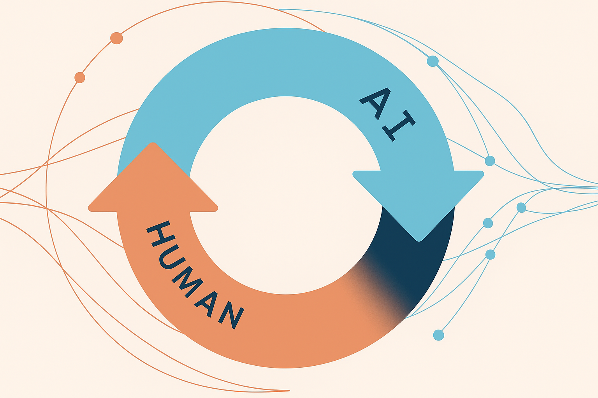

# AI Cookbook for Developers, BA & Testers

> **Tài liệu hướng dẫn ứng dụng AI vào quy trình phát triển phần mềm tại FPT IS**

## Giới thiệu

Trong bối cảnh công nghệ liên tục đổi mới, **trí tuệ nhân tạo (AI)** đã trở thành một phần không thể thiếu trong mọi hoạt động phát triển phần mềm hiện đại. Bộ tài liệu **AI Cookbook** này được xây dựng dành riêng cho đội ngũ BA (Business Analyst), Tester và Developer tại FPT IS, cung cấp các **công thức thực tiễn**, **quy trình tối ưu**, và **thủ thuật hữu ích** để tận dụng tối đa sức mạnh AI vào công việc hàng ngày.

---

## Đối tượng sử dụng

- **Business Analyst (BA):**  
  Hỗ trợ phân tích nghiệp vụ, tổng hợp & phân loại yêu cầu, tự động hóa viết tài liệu và báo cáo.

- **Tester:**  
  Đề xuất & sinh test case tự động, hỗ trợ kiểm thử dựa trên AI, tổng hợp báo cáo kiểm thử nhanh chóng.

- **Developer:**  
  Tăng tốc độ viết code, tự động sinh tài liệu kỹ thuật, tối ưu quy trình review code & quản lý kiến thức dự án.

---

## Cán bộ sẽ nhận được gì từ tài liệu này?

- **Tích hợp AI vào Editor:**  
  Hướng dẫn sử dụng các Idea AI như Cursor trong phát triển phần mềm

- **Tạo tài liệu kỹ thuật tự động:**  
  Ứng dụng AI vào việc tạo và nâng cao chất lượng tài liệu dự án, DDD, FSD , BA docs, API docs...

- **Workflow chuyên nghiệp:**  
  Các quy trình đã kiểm chứng để làm việc hiệu quả với các công cụ AI như Gemini, GPT, Claude...

- **Kỹ thuật Prompting nâng cao:**  
  Bí quyết giao tiếp với AI để nhận được kết quả chính xác, phù hợp nhu cầu thực tế từng vị trí.

- **Quản lý tri thức:**  
  Chuyển đổi tài liệu rời rạc thành cơ sở tri thức tập trung, hỗ trợ chia sẻ & tra cứu hiệu quả.

---

## Nguyên tắc sử dụng AI hiệu quả

### 🎯 **AI là công cụ, không phải thay thế**

AI hoạt động tốt nhất khi được **"kiểm soát chặt chẽ"** (on a tight leash):
- **Luôn kiểm tra và verify** output của AI trước khi sử dụng
- **Đặt câu hỏi cụ thể** thay vì câu hỏi mơ hồ
- **Chia nhỏ tác vụ phức tạp** thành các bước đơn giản

### ⚠️ **Những điều cần lưu ý**

:::danger Bảo mật thông tin
- **Không bao giờ** chia sẻ thông tin nhạy cảm, API keys, passwords với AI
- **Xóa hoặc che giấu** dữ liệu khách hàng trước khi sử dụng AI
- **Tuân thủ chính sách bảo mật** của công ty khi làm việc với AI
:::

:::warning Kiểm soát chất lượng
- **AI có thể tạo ra code/tài liệu sai** - luôn review kỹ lưỡng
- **Không copy-paste mù quáng** - hiểu rõ code trước khi sử dụng
- **Test thoroughly** mọi code được AI generate
:::

### 💡 **Best Practices**

1. **Bắt đầu nhỏ:** Thử với các tác vụ đơn giản trước khi tackle các vấn đề phức tạp
2. **Iterative approach:** Cải thiện prompt dần dần để có kết quả tốt hơn
3. **Context is king:** Cung cấp càng nhiều context càng tốt (@file, requirements, constraints)
4. **Learn the tools:** Mỗi AI tool có điểm mạnh riêng - GPT cho creative writing, Copilot cho code, Claude cho analysis

:::danger Cần lưu ý
*   **Hallucination (AI "ảo giác"):** AI có thể bịa ra các API hoặc cú pháp không tồn tại. Luôn kiểm tra lại code do AI sinh ra.
*   **Prompt quá lớn:** Thay vì một yêu cầu lớn như "Xây dựng toàn bộ tính năng giỏ hàng", hãy chia nhỏ nó ra theo quy trình đã nêu ở trên.
*   **Quên ngữ cảnh:** Luôn kiểm tra lại các file đã `@` hoặc đã ghim trong tab AI để chắc chắn rằng AI đang có đủ thông tin. Nếu kết quả không như ý, việc đầu tiên cần làm là kiểm tra lại ngữ cảnh.
::: 
---

## Phương pháp biên soạn

Tài liệu không chỉ tập trung vào lý thuyết, mà ưu tiên **ví dụ thực tế**, **quy trình sẵn dùng**, **mẫu prompt tối ưu**, **template quy trình**, đảm bảo ứng dụng trực tiếp vào các dự án phần mềm tại FPT IS.

---
